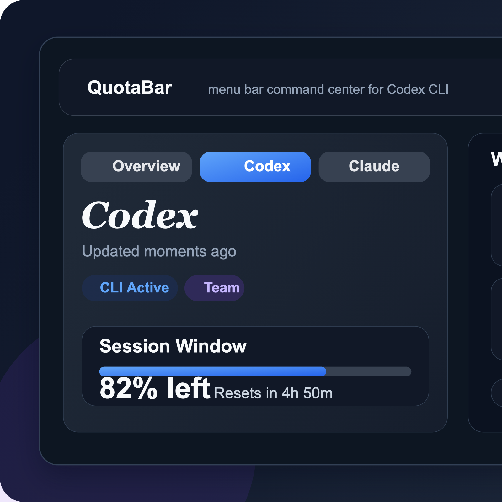
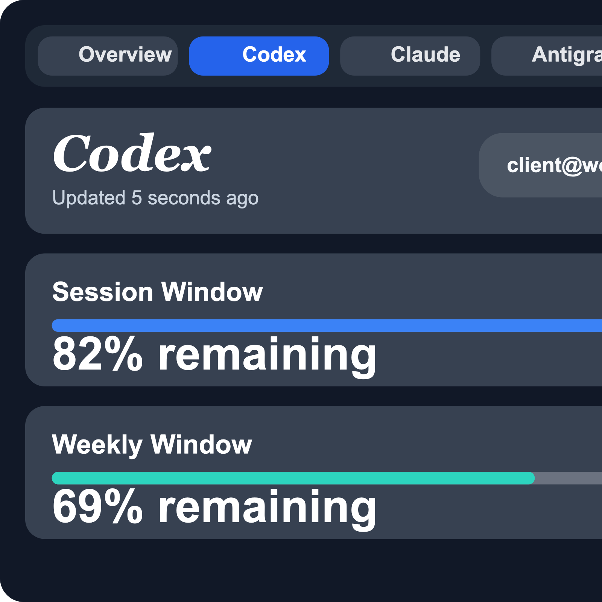
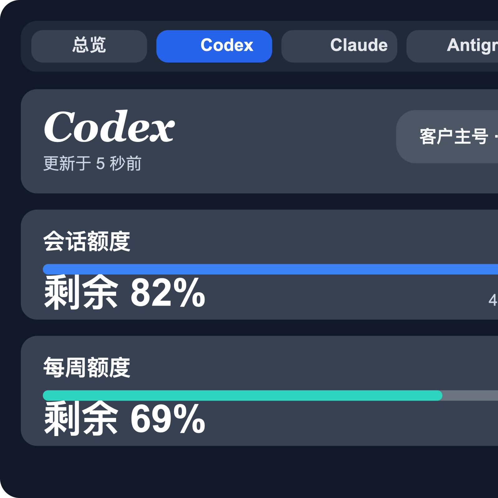
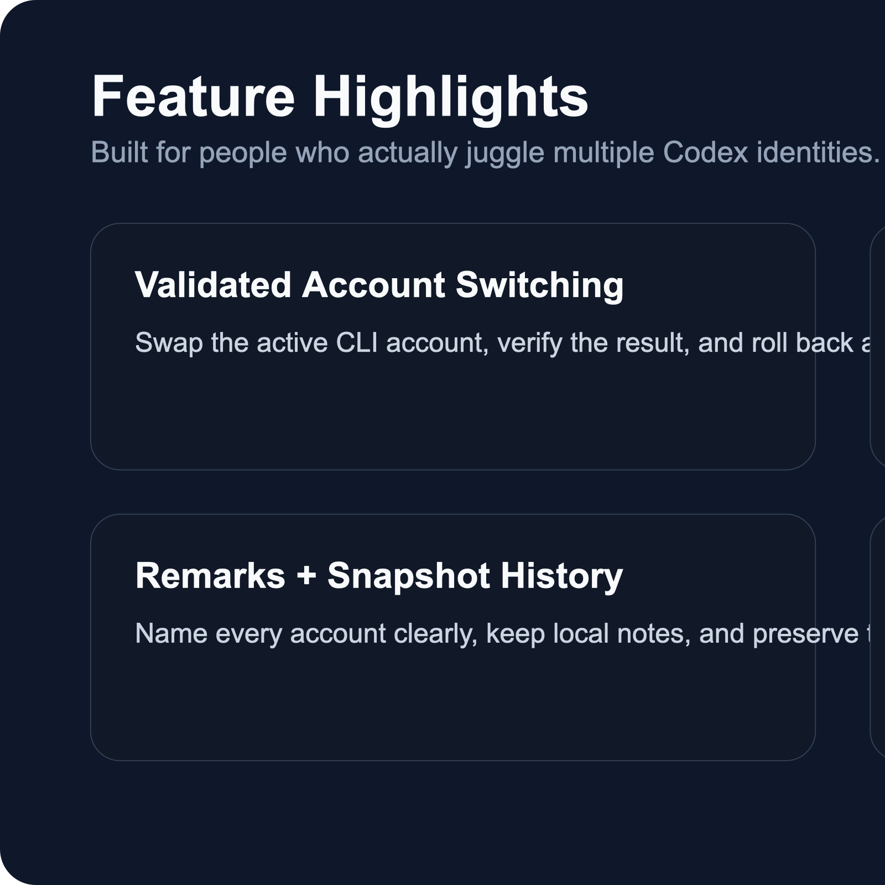
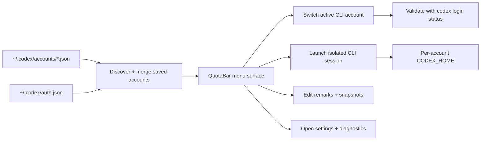

<p align="center">
  
</p>

<h1 align="center">QuotaBar</h1>

<p align="center">
  <strong>A local-first macOS menu bar command center for Codex CLI account switching, quota visibility, and isolated sessions.</strong><br>
  The repository slug stays <code>codextoken</code>, while the outward-facing product brand is now <code>QuotaBar</code>.
</p>

<p align="center">
  <a href="#install"></a>
  <a href="#product-tour"></a>
  <a href="#supported-languages"></a>
  <a href="README_CN.md"></a>
</p>

<p align="center">
  
  
  
  
  
</p>

<p align="center">
  
</p>

## Why QuotaBar

Codex CLI becomes awkward the moment you operate across multiple identities.

You end up hand-editing `~/.codex/auth.json`, second-guessing which account is active, losing track of your 5-hour and weekly windows, and opening disposable shells just to keep sessions separated.

QuotaBar turns that into a real product surface:

- switch the active Codex CLI account with validation and rollback
- compare saved accounts by quota window before you launch work
- attach local remarks so every account stays recognizable
- preserve the current session as a reusable snapshot
- launch isolated CLI sessions with per-account `CODEX_HOME`
- keep local provider diagnostics in one place

---

## Product Tour

<p align="center">
  
</p>

<p align="center">
  <em>The menu bar entry is always visible now, with a stable <code>QB</code> badge fallback plus SF Symbol support.</em>
</p>

### Localized Interface Previews

<table>
<tr>
<td width="50%">
  
</td>
<td width="50%">
  
</td>
</tr>
<tr>
<td align="center"><strong>English UI</strong></td>
<td align="center"><strong>中文界面</strong></td>
</tr>
</table>

### Feature Display

<p align="center">
  
</p>

---

## Highlights

- **Validated account switching**: write the target snapshot into the live CLI, verify it with `codex login status`, and roll back on failure.
- **Built for real multi-account use**: saved snapshots, duplicate merging, hidden one-off sessions, remarks, and stable local ordering are built in.
- **Quota-first workflow**: see 5-hour and weekly windows before you burn the wrong account.
- **Isolated CLI launches**: open a dedicated Terminal session for any account with its own `CODEX_HOME` and copied config.
- **Useful settings instead of filler**: language, startup tab, auto refresh, diagnostics, account management, storage shortcuts, and advanced quota controls.
- **Right-click shortcuts**: refresh, settings, re-login, switch account, import current session, and open CLI directly from the menu bar icon.

---

## Supported Languages

QuotaBar now ships with these built-in interface languages:

- English
- 简体中文
- 繁體中文
- 日本語
- 한국어
- Español
- Português (Brasil)

`Follow System` is also supported, so the app automatically matches macOS when a bundled language pack exists.

---

## Install

> Requirements: macOS 14+, Xcode, and [XcodeGen](https://github.com/yonaskolb/XcodeGen)

```bash
brew install xcodegen
git clone https://github.com/Zhao73/codextoken.git
cd codextoken
xcodegen generate
open CodexToken.xcodeproj
```

Then press `⌘R`. The app runs as a menu bar utility.

### Run tests

```bash
xcodebuild test \
  -project CodexToken.xcodeproj \
  -scheme CodexTokenCore \
  -destination 'platform=macOS'
```

---

## Workflow



---

## Project Structure

| Layer | Responsibility |
| :--- | :--- |
| `CodexTokenCore` | Account discovery, metadata persistence, snapshot import/removal, CLI switching, quota providers |
| `CodexTokenApp` | SwiftUI menu bar UI, settings window, local caches, remarks, Terminal launch flows |
| Local files | `auth.json`, `accounts/*.json`, metadata JSON, copied config for isolated sessions |

### Design choices

- **Atomic switching** keeps failed swaps from corrupting the active CLI session.
- **Bundle-based localization** keeps the app lightweight and dependency-free.
- **Provider snapshots with local fallback** keep quota panels usable even when upstream data is partial.
- **Outward-only rebrand** keeps the stable repo slug and target structure while presenting a cleaner product brand.

---

## Privacy

QuotaBar is local-first.

- No telemetry
- No analytics
- No cloud account sync
- No token relay service
- No third-party runtime dependency for core workflow

See [PRIVACY.md](PRIVACY.md), [SECURITY.md](SECURITY.md), and [CONTRIBUTING.md](CONTRIBUTING.md) for more details.

---

<p align="center">
  <strong>QuotaBar</strong> by Zhao73<br>
  If it makes your Codex workflow calmer and faster, consider starring the repo.
</p>
