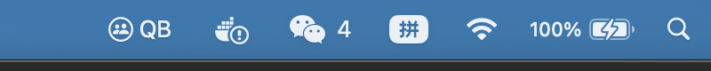
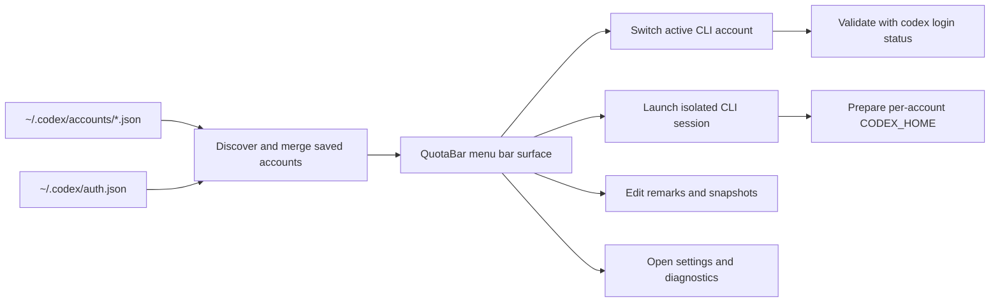

<p align="center">
  
</p>

<h1 align="center">QuotaBar</h1>

<p align="center">
  <strong>A polished macOS menu bar companion for Codex CLI multi-account switching, quota visibility, and isolated sessions.</strong>
</p>

<p align="center">
  QuotaBar is the public project name for this repository and app.
</p>

<p align="center">
  <a href="README_CN.md"></a>
  
  
</p>

<p align="center">
  
</p>

## Why QuotaBar feels better

Codex CLI gets awkward as soon as you juggle more than one identity.

QuotaBar turns that into a menu bar workflow that feels deliberate instead of manual:

<table>
<tr>
<td width="33%" valign="top">
  <strong>Switch safely</strong><br>
  Validate the target account, roll back on failure, and protect the active CLI session.
</td>
<td width="33%" valign="top">
  <strong>Choose by quota</strong><br>
  Compare 5-hour and weekly windows before you spend the wrong account. See at a glance which accounts need re-login.
</td>
<td width="33%" valign="top">
  <strong>Keep sessions isolated</strong><br>
  Launch per-account shells with their own <code>CODEX_HOME</code> and copied config.
</td>
</tr>
</table>

<p align="center">
  
</p>

## Product tour

<p align="center">
  
</p>

<p align="center">
  <em>A visible menu bar entry matters. QuotaBar now keeps a stable <code>QB</code> fallback so the app never feels invisible.</em>
</p>

<p align="center">
  
</p>

## What you can do from one place

- Switch the active Codex CLI account with validation and rollback
- Save the current session as a reusable snapshot
- Attach local remarks to every account so names stay recognizable
- Open isolated CLI sessions for any saved account
- Refresh quota windows and provider diagnostics without leaving the menu bar
- Get proactive warnings when sessions expire or need re-login
- One-click re-login when a token has expired, without leaving QuotaBar
- Manage language, startup behavior, diagnostics, and account storage from settings

## Built-in languages

- English
- 简体中文
- 繁體中文
- 日本語
- 한국어
- Español
- Português (Brasil)
- Follow System

## Install

> Requirements: macOS 14+, Xcode, and [XcodeGen](https://github.com/yonaskolb/XcodeGen)

```bash
brew install xcodegen
git clone https://github.com/Zhao73/quotabar.git
cd codextoken
xcodegen generate
open CodexToken.xcodeproj
```

Run the app with `⌘R`. It launches as a menu bar utility.

<details>
<summary><strong>Run tests</strong></summary>

```bash
xcodebuild test \
  -project CodexToken.xcodeproj \
  -scheme CodexTokenCore \
  -destination 'platform=macOS'
```

</details>

<details>
<summary><strong>Architecture and workflow</strong></summary>



| Layer | Responsibility |
| :--- | :--- |
| `CodexTokenCore` | Account discovery, metadata persistence, snapshot import/removal, CLI switching, quota providers |
| `CodexTokenApp` | Menu bar UI, settings, local caches, remarks, Terminal launch flows |
| Local files | `auth.json`, `accounts/*.json`, metadata JSON, isolated session config |

</details>

## Privacy

QuotaBar is local-first by default.

- No telemetry
- No analytics SDK
- No cloud account sync
- No token relay service

See [PRIVACY.md](PRIVACY.md), [SECURITY.md](SECURITY.md), and [CONTRIBUTING.md](CONTRIBUTING.md) for details.

<p align="center">
  <strong>QuotaBar</strong> by Zhao73<br>
  If it makes your Codex workflow calmer and faster, consider starring the repo.
</p>
