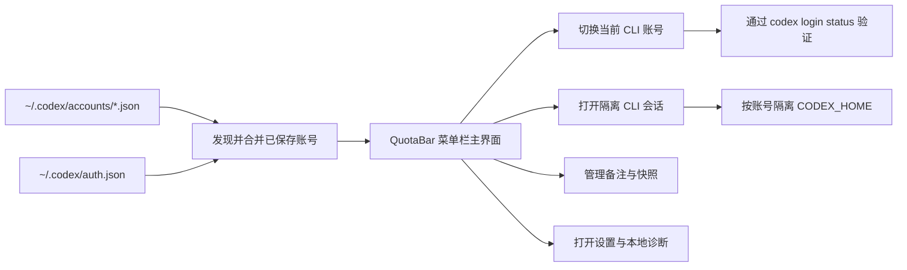

<p align="center">
  
</p>

<h1 align="center">QuotaBar</h1>

<p align="center">
  <strong>一个本地优先的 macOS 菜单栏控制中心，用来管理 Codex CLI 多账号切换、额度窗口和隔离会话。</strong><br>
  仓库 slug 继续保留 <code>codextoken</code>，但产品对外名称升级为更清晰的 <code>QuotaBar</code>。
</p>

<p align="center">
  <a href="#安装"></a>
  <a href="#产品导览"></a>
  <a href="#已支持语言"></a>
  <a href="README.md"></a>
</p>

<p align="center">
  
  
  
  
  
</p>

<p align="center">
  
</p>

## 为什么是 QuotaBar

Codex CLI 一旦进入多账号场景，体验就会立刻变得很手工。

你会反复修改 `~/.codex/auth.json`，很难确认当前到底是哪个账号在工作，也很难在真正开工前看清 5 小时和每周额度窗口，更别说为不同账号隔离 CLI 会话了。

QuotaBar 就是把这些零散动作收拢成一个真正可用的产品界面：

- 切换当前 Codex CLI 账号，并带真实验证和失败回滚
- 开工前对比已保存账号的 5 小时 / 每周额度窗口
- 给账号写本地备注，避免列表越来越难认
- 把当前会话保存成可复用的快照
- 为不同账号启动独立的 `CODEX_HOME` CLI 会话
- 在一个设置页里统一看本地诊断信息

---

## 产品导览

<p align="center">
  
</p>

<p align="center">
  <em>状态栏入口现在有稳定的 <code>QB</code> 文字兜底，不会再出现“程序在跑但右上角什么都没有”的情况。</em>
</p>

### 中英界面预览

<table>
<tr>
<td width="50%">
  
</td>
<td width="50%">
  
</td>
</tr>
<tr>
<td align="center"><strong>English UI</strong></td>
<td align="center"><strong>中文界面</strong></td>
</tr>
</table>

### 功能展示图

<p align="center">
  
</p>

---

## 亮点

- **安全切号**：把目标快照写入当前 CLI 后会做验证，失败自动回滚。
- **真正面向多账号**：支持快照、重复账号去重、一次性会话隐藏、备注、稳定排序。
- **先看额度再开工**：切号前先看 5 小时和每周窗口，避免用错号。
- **隔离 CLI 会话**：任意账号都能打开独立 Terminal，会自动准备自己的 `CODEX_HOME`。
- **设置是真正有用的设置**：语言、启动页、自动刷新、账号管理、本地文件入口、诊断和高级命令都集中在一起。
- **右键快捷动作齐全**：刷新、设置、重新登录、切换账号、导入当前会话、打开 CLI 都能从状态栏图标直接完成。

---

## 已支持语言

QuotaBar 现在内置以下界面语言：

- English
- 简体中文
- 繁體中文
- 日本語
- 한국어
- Español
- Português (Brasil)

同时支持 `跟随系统`，只要你的 macOS 语言命中内置语言包，界面就会自动切换。

---

## 安装

> 环境要求：macOS 14+、Xcode、[XcodeGen](https://github.com/yonaskolb/XcodeGen)

```bash
brew install xcodegen
git clone https://github.com/Zhao73/codextoken.git
cd codextoken
xcodegen generate
open CodexToken.xcodeproj
```

然后按 `⌘R`，应用会以菜单栏工具形式运行。

### 运行测试

```bash
xcodebuild test \
  -project CodexToken.xcodeproj \
  -scheme CodexTokenCore \
  -destination 'platform=macOS'
```

---

## 工作流



---

## 项目结构

| 层 | 责任 |
| :--- | :--- |
| `CodexTokenCore` | 账号发现、元数据持久化、快照导入/删除、CLI 切换、额度 Provider |
| `CodexTokenApp` | SwiftUI 菜单栏 UI、设置窗口、本地缓存、备注、Terminal 启动流程 |
| 本地文件 | `auth.json`、`accounts/*.json`、元数据 JSON、隔离会话配置 |

### 设计取向

- **原子切换**：失败的账号切换不会污染当前 CLI 登录态。
- **Bundle 本地化**：语言包轻量直接，没有额外依赖。
- **Provider 快照 + 本地兜底**：上游数据不完整时，额度面板也不会直接失能。
- **只改对外品牌**：保留稳定的仓库 slug 和内部 target 结构，同时让产品形象更清晰。

---

## 隐私

QuotaBar 是本地优先的。

- 不做遥测
- 不做分析上报
- 不做云端账号同步
- 不做 token 中转
- 核心工作流不依赖第三方运行时服务

更多说明见 [PRIVACY.md](PRIVACY.md)、[SECURITY.md](SECURITY.md)、[CONTRIBUTING.md](CONTRIBUTING.md)。

---

<p align="center">
  <strong>QuotaBar</strong> by Zhao73<br>
  如果它让你的 Codex 多账号工作流更顺手，欢迎给仓库点个 Star。
</p>
