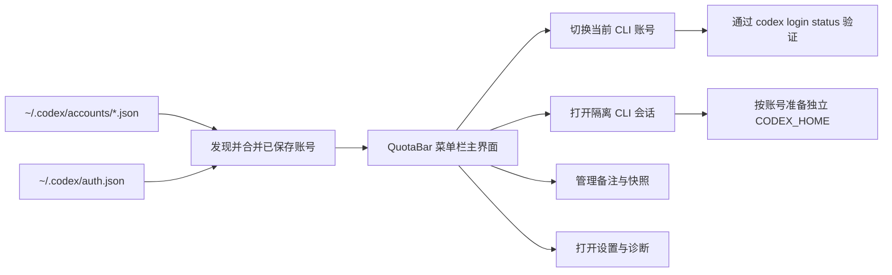

<p align="center">
  
</p>

<h1 align="center">QuotaBar</h1>

<p align="center">
  <strong>一个更精致的 macOS 菜单栏工具，用来管理 Codex CLI 多账号切换、额度窗口和隔离会话。</strong>
</p>

<p align="center">
  QuotaBar 现在就是这个项目对外统一使用的名字。
</p>

<p align="center">
  <a href="README.md"></a>
  
  
</p>

<p align="center">
  
</p>

## 为什么它更像一个成品

Codex CLI 一旦进入多账号场景，体验就很容易退回到手工切文件、靠记忆判断额度、靠临时 shell 隔离环境的状态。

QuotaBar 想解决的不是“再包一层 UI”，而是把这套真实工作流做成一个更顺手的菜单栏产品：

<table>
<tr>
<td width="33%" valign="top">
  <strong>安全切号</strong><br>
  目标账号会被验证，失败自动回滚，不污染当前 CLI 登录态。
</td>
<td width="33%" valign="top">
  <strong>先看额度再开工</strong><br>
  5 小时和每周额度窗口放在一起看，过期账号一目了然，切号决策更直接。
</td>
<td width="33%" valign="top">
  <strong>隔离会话</strong><br>
  每个账号都能打开独立 CLI，会自动准备自己的 <code>CODEX_HOME</code>。
</td>
</tr>
</table>

<p align="center">
  
</p>

## 产品导览

<p align="center">
  
</p>

<p align="center">
  <em>状态栏入口现在有稳定的 <code>QB</code> 兜底，不会再出现“程序在运行但右上角看不到”的情况。</em>
</p>

<p align="center">
  
</p>

## 一个地方就能完成的事

- 切换当前 Codex CLI 账号，并带真实验证和失败回滚
- 保存当前会话，沉淀成可复用账号快照
- 给账号补备注，避免列表越来越难认
- 为任意账号启动隔离 CLI 会话
- 在菜单栏里刷新额度和诊断信息
- 会话过期或需要重新登录时主动提醒，不再显示莫名其妙的错误
- 一键重新登录，无需离开 QuotaBar
- 在设置页集中管理语言、启动页、诊断和本地文件入口

## 内置语言

- English
- 简体中文
- 繁體中文
- 日本語
- 한국어
- Español
- Português (Brasil)
- 跟随系统

## 安装

> 环境要求：macOS 14+、Xcode、[XcodeGen](https://github.com/yonaskolb/XcodeGen)

```bash
brew install xcodegen
git clone https://github.com/Zhao73/quotabar.git
cd codextoken
xcodegen generate
open CodexToken.xcodeproj
```

按 `⌘R` 即可运行，应用会以菜单栏工具形式启动。

<details>
<summary><strong>运行测试</strong></summary>

```bash
xcodebuild test \
  -project CodexToken.xcodeproj \
  -scheme CodexTokenCore \
  -destination 'platform=macOS'
```

</details>

<details>
<summary><strong>架构与工作流</strong></summary>



| 层 | 责任 |
| :--- | :--- |
| `CodexTokenCore` | 账号发现、元数据持久化、快照导入/删除、CLI 切换、额度 Provider |
| `CodexTokenApp` | 菜单栏 UI、设置页、本地缓存、备注、Terminal 启动流程 |
| 本地文件 | `auth.json`、`accounts/*.json`、元数据 JSON、隔离会话配置 |

</details>

## 隐私

QuotaBar 默认就是本地优先：

- 不做遥测
- 不做分析 SDK
- 不做云端账号同步
- 不做 token 中转服务

更多说明见 [PRIVACY.md](PRIVACY.md)、[SECURITY.md](SECURITY.md)、[CONTRIBUTING.md](CONTRIBUTING.md)。

<p align="center">
  <strong>QuotaBar</strong> by Zhao73<br>
  如果它让你的 Codex 多账号工作流更顺手，欢迎点个 Star。
</p>
